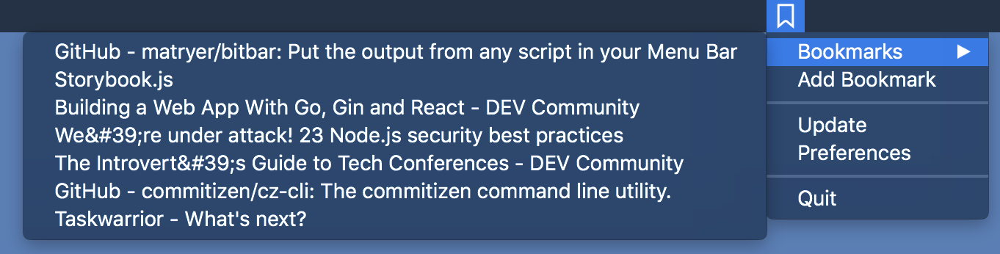

# nextcloud-bookmarks
A mac OS menu bar item for your nextcloud bookmarks

This little Application sits in your menubar and gives you access to your bookmarks from your nextcloud instance.

Just add server adress, username and password in the preferences and you're ready to go.

  

## Getting Started
### Install
If you just want to use Nextcloud Bookmarks, you can (soon) download it from the relases page.

### Build
You can build the app from scratch. Aside from Xcode 9 it has no further dependencies, so with Xcode installed you can build it from the commandline with `xcodebuild` or by running it from inside Xcode.

## Contributing
PRs are welcome! Please file your PR against the develop branch.
